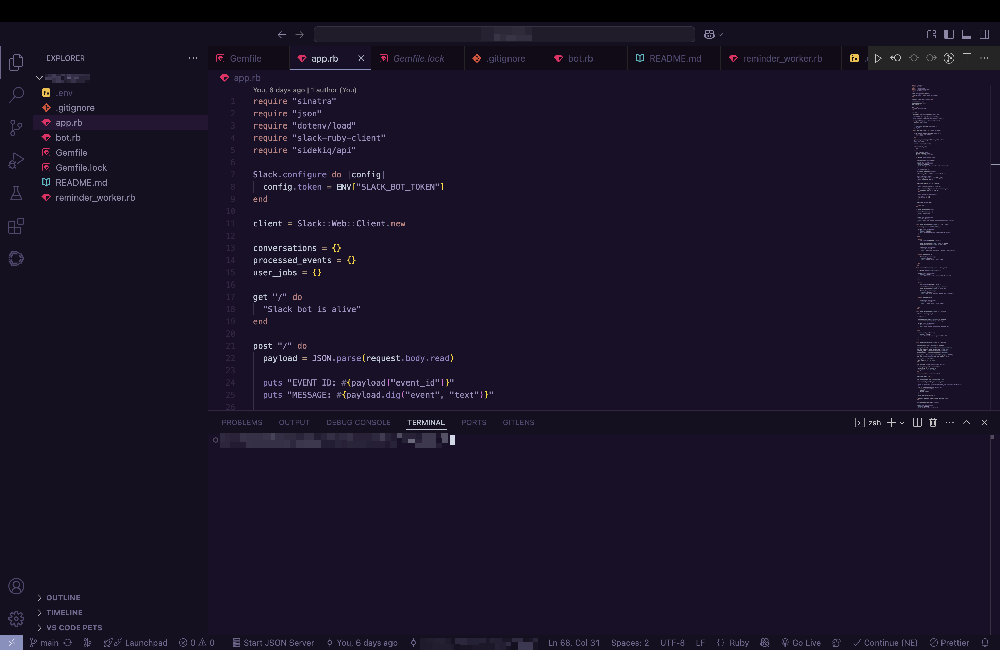
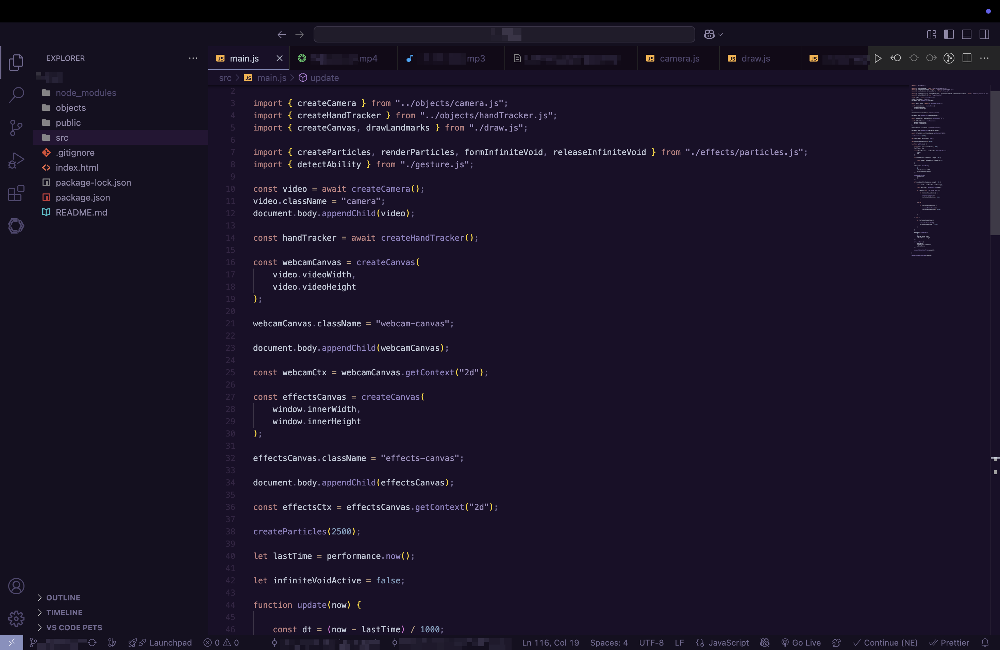

## ABOUT ECLIPSE THEME

A deep violet VS Code theme for coding after dark.

Eclipse theme was specifically designed for midnight coding, especially in an environment with little to no light. It is a dark, atmospheric interface built to stay comfortable when your laptop is the last light left in the room.

## THEME PREVIEW

## DESIGN

The theme was explicitly designed to be easy on the eyes.

The editor uses a rich violet foundation rather than pure black, while surrounding UI elements remain subtle and understated.

Syntax colors are intentionally distinct, but kept controlled enough for long coding sessions.

## FEATURES

- Deep violet editor background
- Rich, multi-color syntax highlighting
- Low glare UI designed for dark environments
- Atmospheric purple focused palette
- Designed for long coding sessions

## INSTALLATION

### VS CODE MARKETPLACE

Search for **Eclipse** in the VS Code Extensions panel and click **Install**.

Or install it directly from the Marketplace.

### Activate Eclipse

After installation:

1. Open the Command Palette:
   - **macOS:** `⌘ + Shift + P`
   - **Windows/Linux:** `Ctrl + Shift + P`

2. Search for **Preferences: Color Theme**

3. Select **Eclipse**